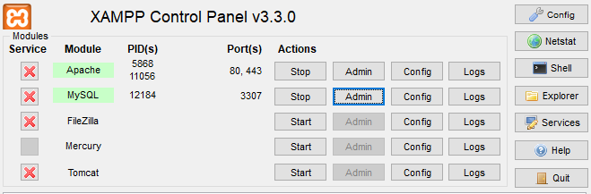
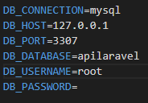

# Desafio-STW

# Sumário

- [Tecnologias utilizadas](#tecnologias-utilizadas)
- [Como Utilizar](#como-utilizar)
- [Um pouco sobre minha experiência](#um-pouco-sobre-minha-experiência)

# Tecnologias utilizadas

- [Laravel](https://laravel.com/)
- [PHP](https://www.php.net/)
- [Vue.js](https://vuejs.org/)
- [Javascript](https://developer.mozilla.org/pt-BR/docs/Web/JavaScript)
- [HTML](https://developer.mozilla.org/pt-BR/docs/Web/HTML)
- [CSS](https://developer.mozilla.org/pt-BR/docs/Web/CSS)
- [MySQL](https://www.mysql.com/)
- [XAMPP](https://www.apachefriends.org/pt_br/index.html)
- [Postman](https://www.postman.com/)
---

# Como utilizar

## Ferramentas necessárias

 * Para rodar o projeto, você vai precisar instalar as seguintes ferramentas:
[XAMPP](https://www.apachefriends.org/pt_br/index.html) (que vai trazer algumas ferramentas, como o PHP);
* Um editor para trabalhar com o código como [VSCode](https://code.visualstudio.com/);

 ## Rodando no servidor local

- Dentro do painel do "XAMPP":
  - Clicar em "start", tanto no "Apache" quanto no "MySQL". Que deverá ficar assim:
  - 

 - Clone do Projeto

    - Clone este repositório dentro de um pasta que esteja dentro desse caminho: "C:\xampp\htdocs"
    (git clone https://github.com/gabrieldelfurini/stw-desafio-tecnico.git)
    
  - Configure o Banco de Dados
    - No terminal do XAMPP aperte no botão "Admin" na coluna da opção "MySQL";
    - Dentro do phpMyAdmin, crie uma base de dados com o nome que desejar;
    - Dentro da pasta "backend" acesse o arquivo ".env", e renomeie o valor de "DB_DATABASE" passando o nome daquele que você criou;
    - 
    
 - Inicie o sistema:

    - Dentro de um terminal, inicie o backend:
   cd backend && php artisan serve

    - Em outro terminal, inicie o frontend:
    cd frontend && npm run dev

    Agora abra no navegador os links que aparecem nos dois terminais. Eles devem ser algo como "http://localhost/..."

---

  # Um pouco sobre minha experiência
Foi um grande desafio pra mim, já que eu **nunca tinha entrado em contato com PHP, Laravel e Vuejs.** Eu já tinha visto alguns conteúdos sobre essas tecnologias mas nada algo muito profundo como foi nesse projeto. **Tive que me organizar de forma a poder conseguir estudar o básico para conseguir pelo menos entregar um projeto funcional.**

Então dividi meus 3 primeiros dias para **estudar as tecnologias que não conhecia profundamente (separei um dia pra cada).** E depois foquei no desenvolvimento do projeto mesmo, pesquisando bastante **até encontrar a solução de um problema que havia encontrado, ou para poder terminar alguma funcionalidade** que não tinha muita noção de como implementar.

Sobre os diferenciais, quase consegui fazer todos eles. Quase consegui concluir a autenticação, já que no curso que vi sobre Laravel eu escutei sobre o **"Laravel Jetstream".** Mas como deixei essa funcionalidade pro final do projeto, acabei que não tive todo o tempo necessário pra poder me dedicar a construir ela (principalmente o tempo para solucionar os problemas que poderiam ser causados se eu instalasse essa ferramenta); então optei por não construí-la.

Eu já escutei que as principais habilidades de um programador são: **resolução de problemas, criatividade, comunicação e resiliência.** Acho que pude provar pra mim mesmo que eu **possuo essas habilidades,** além de poder ter melhorado elas durante esse projeto; porque como falei, foi um dos maiores desafios que já fiz em relação à programação. Mas eu também fico animado porque **penso no que eu posso fazer, tendo em vista esse desafio que terminei (saindo praticamente do zero), nesse pouco período de tempo.**

E também queria agradecer pela **oportunidade** de participar desse processo.

